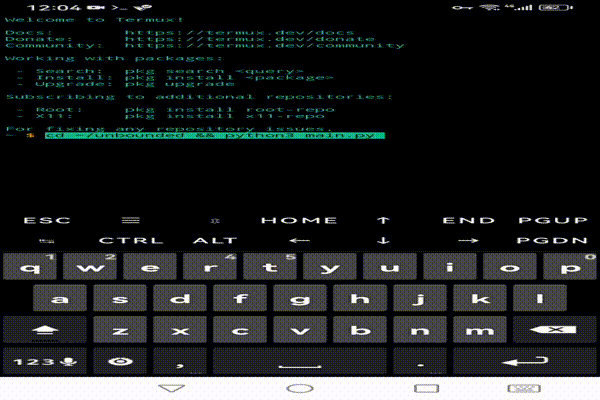

# Unbounded

> **Unbounded 不是 Open World，是 Open Rule World。**
>
> 世界先存在。玩家后来进入。玩家离开以后，世界依然存在。
> 这是一个由规律驱动而非内容驱动的电子世界。
>
> 📖 [项目宪法](docs/00_PROJECT_PHILOSOPHY.md) | 🌍 [世界模型](docs/01_WORLD_MODEL.md) | 🏗 [架构](docs/02_ARCHITECTURE.md)

从一把土到一颗螺丝，到一把锤子，到一台机床，到一个工厂，到一座城市，到一颗星球。需要的是时间和知识。

> From a handful of dirt to a screw, to a hammer, to a machine tool, to a factory, to a city, to a planet. All it takes is time and knowledge.

## Gameplay 演示

## 快速开始

    python3 main.py

## 架构

纯 Python 标准库（curses）实现，无第三方依赖，运行于 Termux/Android。

- main.py：入口，Game 类作为门面（facade），持有各子系统状态
- config.py：全局配置，按功能分组（视口/世界/玩家/生成/键位等）
- core/：状态机框架本身
- systems/：所有世界规律，按领域分包（combat/entity/gameplay/world/core）
- ui/states/：界面状态，State Machine 模式，一个界面一个 State 类
- data/*.json：怪物、物品、配方、交互规则等数据驱动内容
- tests/：冒烟测试 + 压力测试 + 长回合仿真测试

核心设计原则见 [项目宪法](docs/00_PROJECT_PHILOSOPHY.md) 与 [架构文档](docs/02_ARCHITECTURE.md)。

## 测试

    python3 tests/smoke_test_full.py

其余测试见 tests/ 目录。

## 开发状态

当前开发进度、已知技术债、下次会话待办见 [STATUS.md](STATUS.md)（滚动更新）。

## 许可

MIT
